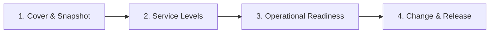

# NordIQ SEJFA

Docs as Code-struktur för skolmaterialet **Go-Live Readiness Package** för NordIQ, en AI-stödd First-Line Support-tjänst vid NordTech AB.

Källdokumentet är facit: [NordIQ_Go-Live_Readiness_Package-v2.md](./NordIQ_Go-Live_Readiness_Package-v2.md)

## Navigation

- [1. Cover & Snapshot](./docs/01-cover-snapshot.md)
- [2. Service Levels](./docs/02-service-levels.md)
- [3. Operational Readiness](./docs/03-operational-readiness.md)
- [4. Change & Release](./docs/04-change-release.md)

