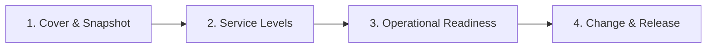

# NordIQ SEJFA

Docs as Code-struktur för skolmaterialet **Go-Live Readiness Package** för NordIQ, en AI-stödd First-Line Support-tjänst vid NordTech AB.

## Syfte

Detta repo beskriver hur NordIQ kan gå till produktion på ett kontrollerat sätt med ITIL-fokus: tjänstebild, servicenivåer, operativ beredskap samt change/release.

## Målgrupp

- Kursgrupp/lärare inom ITIL och service management
- Roller som ska fatta go/no-go-beslut (CIO, IT Ops, Dev, CFO, HR)
- Team som ansvarar för drift, incident och förbättring

## Läs i denna ordning

1. [1. Cover & Snapshot](./docs/01-cover-snapshot.md)
2. [2. Service Levels](./docs/02-service-levels.md)
3. [3. Operational Readiness](./docs/03-operational-readiness.md)
4. [4. Change & Release](./docs/04-change-release.md)

## Status

- **Mognad:** Utkast för skolleverans
- **Sanningskälla:** [NordIQ_Go-Live_Readiness_Package-v2.md](./NordIQ_Go-Live_Readiness_Package-v2.md)
- **Struktur:** Standardiserad sidmall för alla huvuddelar

## Docs-as-Code arbetssätt

### PR-granskning för docs

Alla ändringar i dokumentation ska gå via Pull Request och granskas av minst en person innan merge.

### Versionshistorik via commits

Historik och beslut spåras i commit-meddelanden. Uppdatera dokumenten inkrementellt istället för stora engångsändringar.

### Definition of Done (dokument)

- [ ] Sidan följer mallen: Varför, Beslut/Krav, Mätetal, Ansvarig, Nästa steg
- [ ] Innehållet är konsekvent med övriga docs och källdokument
- [ ] Max ett Mermaid-diagram per sida
- [ ] Sektionen **Vidare läsning** finns längst ner
- [ ] Stavning/format är kontrollerat i Markdown-preview

## Presentation (om ni vill ha snyggare UI)

Om ni vill presentera samma innehåll med bättre navigation/sök kan ni publicera docs med t.ex. MkDocs eller Docusaurus utan att skriva om själva innehållet.
