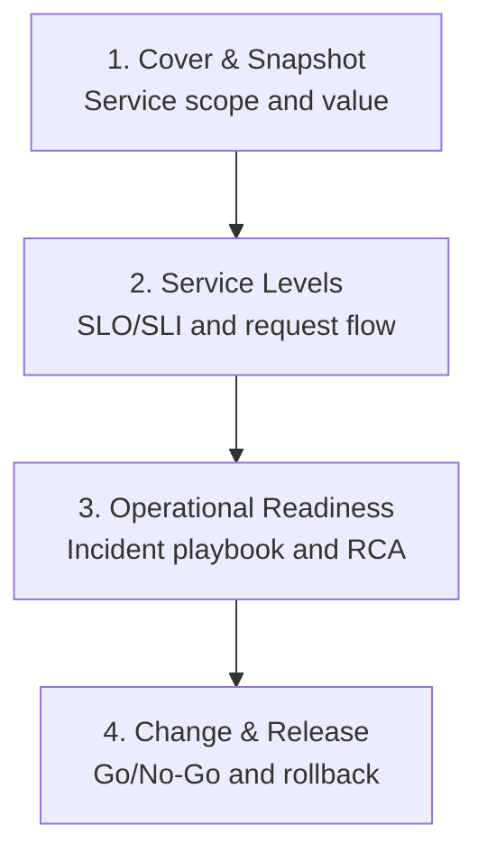

# NordIQ SEJFA

Docs-as-Code repository for the **NordIQ Go-Live Readiness Package**.

## Go-Live Readiness Document Set

- [1. Cover & Snapshot](./docs/01-cover-snapshot.md)
- [2. Service Levels](./docs/02-service-levels.md)
- [3. Operational Readiness](./docs/03-operational-readiness.md)
- [4. Change & Release](./docs/04-change-release.md)

## Scope

This repo focuses on go-live decision support for CIO/CAB and operating teams.

## Working Model

- Pull Request review before merge
- Incremental updates via commits
- Keep content short, presentation-ready, and aligned across all pages

## Source Material

- [NordIQ_Go-Live_Readiness_Package-v2.md](./NordIQ_Go-Live_Readiness_Package-v2.md)
