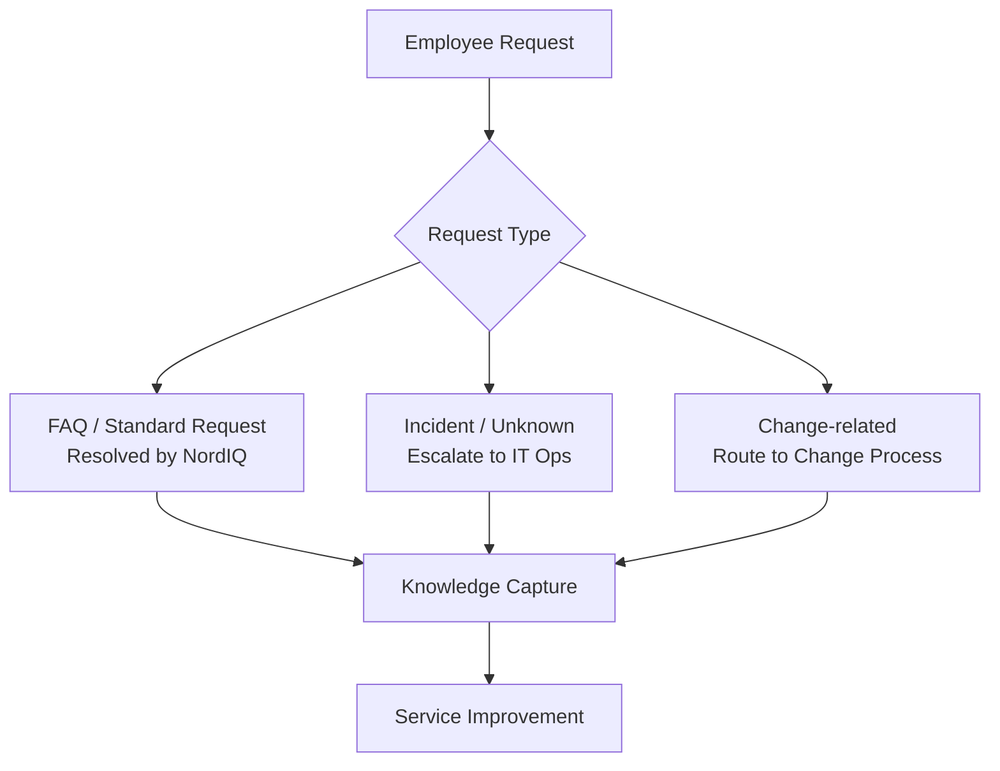

# 1. Cover & Snapshot

*Service framing for go-live decisions.*

## Service Overview

NordIQ provides AI-assisted first-line support with clear escalation to IT Ops when automation cannot resolve the case.

- **Utility:** Fast self-service, intelligent triage, lower manual load
- **Warranty:** High availability, controlled failover, current knowledge base
- **Risk focus:** AI answer ownership, classification quality, supplier dependency

## Stakeholder Snapshot

| Role | Value | Key Risk |
| :--- | :--- | :--- |
| HR | Faster onboarding support | Incorrect AI answers |
| IT Ops | Lower repetitive ticket volume | Misrouted escalations |
| Dev | Fewer L1 interruptions | Platform accountability on AI errors |
| CIO | Scalable support model | Go-live decision exposure |
| CFO | More predictable support cost | Variable API/hosting spend |

## Service Operating Model

## KPI Snapshot

- AI first response target: **p95 <= 5s**
- Escalation for unresolved requests: **<= 2 min**
- Knowledge base update cycle: **<= 24h**

## Related Docs

- [2. Service Levels](./02-service-levels.md)
- [3. Operational Readiness](./03-operational-readiness.md)
- [4. Change & Release](./04-change-release.md)
