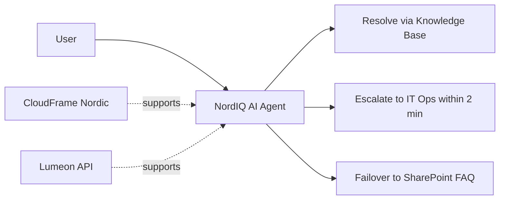

# 1. Cover & Snapshot

*Describes NordIQ in service language — not as a stack.*

## Service Definition

NordIQ är en tjänst som gör det möjligt för NordTechs medarbetare att få snabbare hjälp med vanliga IT-supportbehov.

## Stakeholders & Value Statements

### Risker per roll

| Roll | Risk Removed | Risk Imposed | Cost Removed | Cost Imposed |
| :--- | :--- | :--- | :--- | :--- |
| Lina, HR | Kan onboarda utan flaskhals hos IT | AI-hallucinationer kan ge fel access | Tidseffektivt om det fungerar | Dubbelarbete om det inte fungerar |
| Karl, Dev | Mindre brandsläckning på enkla L1-ärenden | Fel svar pekar mot plattformen han byggt | Slipper manuell support för FAQ-ärenden | Äger kunskapsbasen |
| Martin, CIO[^cio] | Politisk risk minskar om NordIQ levererar | Offentligt misslyckande går uppåt | Lägre L1-personalkostnad | Fel timing skadar trovärdigheten |
| Erik, CFO | Förutsägbarare IT-kostnader | Lumeon API-kostnad kan skala okontrollerat | Färre timmar mot L1-support | Ny löpande kostnad för tokens + hosting |

## Utility / Warranty / Risk focus

- Utility: Fast self-service, intelligent triage, lower manual load
- Warranty: High availability, controlled failover, current Knowledge Base
- Risk focus: AI answer ownership, classification quality, supplier dependency

## Service Operating Model

[^cio]: CIO = Chief Information Officer

## Related Docs

- [2. Service Levels](./02-service-levels.md)
- [3. Operational Readiness](./03-operational-readiness.md)
- [4. Change & Release](./04-change-release.md)
