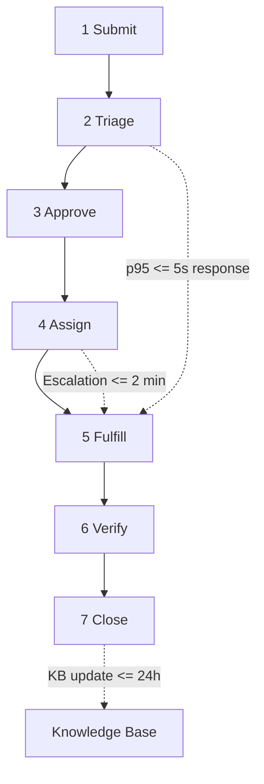

# 2. Service Levels

*SLO/SLI baseline for go-live readiness.*

## SLO Baseline

| SLI | Target SLO | Operational Intent |
| :--- | :--- | :--- |
| AI response time | p95 <= 5 sec | Keep support interaction immediate |
| Availability | 99.5% per month | Support 24/7 positioning |
| Classification accuracy | >= 90% | Reduce incorrect routing |
| Time to escalation | <= 2 min | Fast handover to IT Ops |
| KB synchronization | <= 24h | Prevent outdated AI answers |

## Service Request Handling

| Step | Stage | Expected handling |
| :--- | :--- | :--- |
| 1 | Submit | Request enters via Teams, email, or portal |
| 2 | Triage | NordIQ classifies FAQ/Incident/Request/Change |
| 3 | Approve | Approval requested where policy requires |
| 4 | Assign | Routed to AI, IT Ops, Incident, or Change track |
| 5 | Fulfill | Resolution by AI or resolver team |
| 6 | Verify | User or system confirms outcome |
| 7 | Close | Ticket closes and learning is captured |

## Related Docs

- [1. Cover & Snapshot](./01-cover-snapshot.md)
- [3. Operational Readiness](./03-operational-readiness.md)
- [4. Change & Release](./04-change-release.md)
