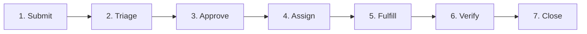

# 2. Service Levels

*Defines what “good enough” means before go-live.*

## Varför

Denna sida definierar vad som är tillräckligt bra kvalitet i drift innan produktion: svarstid, tillgänglighet, klassificering, eskalering och kunskapsuppdatering.
Målen är satta för att spegla användarnas förväntan på snabb hjälp, NordIQ:s 24/7-positionering, riskerna med felklassificering samt behovet av snabb handover till IT Ops när AI:n inte kan lösa ett ärende.

## Beslut / Krav

- SLO ska vara mätbara via tydliga SLI:er.
- Service Request-flödet ska följas från inkommen förfrågan till stängning.
- OLA per steg ska vara beslutad och möjlig att följa upp.
- Ärenden som AI inte kan lösa ska eskaleras snabbt till IT Ops.

## Mätetal

| Vad mäts (SLI) | Internt mål (SLO) | Rationale |
| :--- | :--- | :--- |
| AI-agentens svarstid | p95 inom 5 sekunder | Användare förväntar sig omedelbar hjälp. |
| Tillgänglighet | 99,5 % per kalendermånad | Tjänsten ska fungera som 24/7-stöd. |
| Korrekt klassificering | 90 % rätt kategoriserade | Felklassificering driver warranty-risk och fel eskalering. |
| Tid till eskalering | Inom 2 minuter | Okända ärenden ska snabbt nå IT Ops. |
| Knowledge Base-synk | Uppdaterad inom 24 timmar | Föråldrad kunskap ger felaktiga AI-svar. |

## Ansvarig

- **SLO-ägare:** Anna (IT Ops Lead)
- **Teknisk leverans av mätdata:** Karl (Dev Lead)
- **Uppföljning mot verksamhetsvärde:** Martin (CIO)

## Nästa steg

1. Säkerställ att mätdata kan tas ut för samtliga SLI:er.
2. Verifiera att OLA-tiderna är förankrade hos IT Ops.
3. Definiera rapporteringsrutin före och efter go-live.

## Vidare läsning

- [1. Cover & Snapshot](./01-cover-snapshot.md)
- [3. Operational Readiness](./03-operational-readiness.md)
- [4. Change & Release](./04-change-release.md)
