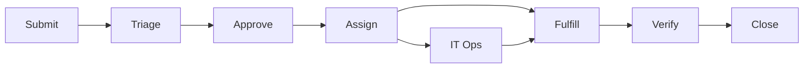

# 2. Service Levels

*Defines what "good enough" means before go-live.*

## Internal SLOs (Service Level Objectives)

SLO = mål. SLI = mätning av målet.

| SLI | SLO | Rationale |
| :--- | :--- | :--- |
| AI-agentens svarstid per förfrågan | p95 svar inom 5 sekunder | Användare förväntar sig omedelbar hjälp |
| Tjänstens tillgänglighet (uptime) | 99,5 % per kalendermånad | 24/7-stöd med ~3,6 h tolererat avbrott |
| Korrekt klassificering av ärenden | 90 % rätt kategoriserade | Fallback ska inte triggas för ofta |
| Tid till eskalering vid okänt ärende | Eskalering inom 2 minuter | IT Ops ska nås snabbt |
| Kunskapsbas-synk | Knowledge Base uppdaterad inom 24 h | Korrekt information kräver aktuell KB |

## Service Request Handling

| Steg | Namn | NordTech |
| :--- | :--- | :--- |
| 1 | Submit | Ärendet skickas in via Teams, e-post eller webbportal |
| 2 | Triage | NordIQ klassificerar FAQ / Incident / Request / Change |
| 3 | Approve | Godkännande hämtas vid behov |
| 4 | Assign | AI, IT Ops eller annan resolver tar ärendet |
| 5 | Fulfill | AI löser 40–60 %; övrigt hanteras enligt prioritet |
| 6 | Verify | Lösningen verifieras av användare eller kontroll |
| 7 | Close | Ärendet stängs; KB uppdateras inom 24 h vid behov |

## Related Docs

- [1. Cover & Snapshot](./01-cover-snapshot.md)
- [3. Operational Readiness](./03-operational-readiness.md)
- [4. Change & Release](./04-change-release.md)
