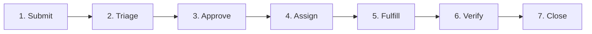

# 2. Service Levels

*Defines what “good enough” means before go-live.*

## Internal SLOs (Service Level Objectives)

För varje SLO definierar NordTech ett SLI — det vill säga den statistik som går att skapa utifrån systemet. SLO är vårt target; SLI definieras som på vilket sätt NordIQ uppnår SLO. I tabellen mäts SLI genom att samla in faktisk driftdata från tjänsten (t.ex. svarstid, tillgänglighet eller antal lösta ärenden) och jämföra den siffran mot målet i SLO.

| Vad mäts (SLI) | Internt mål (SLO) | Rationale |
| :--- | :--- | :--- |
| AI-agentens svarstid per förfrågan | p95 ska få svar inom 5 sekunder | Lina och övriga användare förväntar sig omedelbar hjälp. |
| Tjänstens tillgänglighet (uptime) | 99,5 % per kalendermånad | NordIQ marknadsförs som 24/7-stöd. 99,5 % ger ~3,6 h tolererat avbrott/månad. |
| Korrekt klassificering av ärenden | 90 % rätt kategoriserade (FAQ / Incident / Request) | Felklassificering är den definierade warranty-risken; 90 % är miniminivå för att fallback inte ska triggas för ofta. |
| Tid till eskalering vid okänt ärende | Eskalering minst inom 2 minuter från inkommet ärende | Om AI:n inte kan hantera ärendet ska det nå Anna/IT Ops innan användaren hunnit ge upp. |
| Kunskapsbas-synk | Uppdaterad Knowledge Base inom 24 h vid kända förändringar | Föråldrad KB ger felaktiga svar — direkt koppling till warranty-kravet om korrekt information. |

## Service Request Handling

NordTech hanterar användares önskemål om hjälp, information eller tillgång till nya resurser genom NordIQ, IT Ops och eventuell eskalering vid behov.

1. **Submit —** Medarbetaren skickar in ärendet via Teams, e-post eller webbportal.
2. **Triage —** NordIQ klassificerar ärendet automatiskt (FAQ / Incident / Request / Change).
3. **Fulfill —** AI-agenten löser 40–60 % av inkommande ärenden.
4. **Eskalering —** Resterande ärenden skickas till Anna (IT Ops) inom 2 minuter (kopplat till SLO 4).
5. **Verify and close —** Ärendet markeras som löst, användaren bekräftar eller ticket stängs automatiskt.

### OLA per steg

| Steg | Rubrik | OLA |
| :--- | :--- | :--- |
| 1 | Förfrågan skickas in | Registreras direkt |
| 2 | Ärendet klassificeras | Klassificering inom 2 sek |
| 3 | Första svar ges | Första AI-svar p95 < 5 sek |
| 4 | Eskalering vid behov | Ticket/eskalering skapas inom 2 min |
| 5 | IT Ops hanterar | Hantering påbörjas enligt prioritet, t.ex. SEV1 inom 15 min, SEV2 inom 60 min |
| 6 | Stängning & lärande | Knowledge Base uppdateras inom 24 h vid känd förändring eller återkommande fel |

### Detaljerat flöde

| Steg | Namn | Vad som händer hos NordTech |
| :--- | :--- | :--- |
| 1 | Submit | Medarbetaren skickar in ärendet via Teams, e-post eller webbportal. Ärendet registreras direkt. |
| 2 | Triage | NordIQ klassificerar ärendet automatiskt som FAQ, Service Request, Incident eller Change. Klassificering sker inom 2 sekunder. |
| 3 | Approve | Om ärendet kräver godkännande skickas det till rätt godkännare, t.ex. chef, budgetägare, security eller dataägare. För fördefinierade låg-risk-ärenden kan godkännandet vara förhandsgodkänt. |
| 4 | Assign | Ärendet routas till rätt fulfiller: AI-agent, IT Ops, Incident Management, Change Enablement, Dev eller extern leverantör. Ärenden som AI inte kan hantera assignas vidare inom 2 minuter enligt SLO 4. |
| 5 | Fulfill | AI-agenten löser cirka 40–60 % av inkommande ärenden. Övriga ärenden hanteras av rätt resolver enligt prioritet. Om ärendet är en incident används SEV-nivåer, t.ex. SEV1 inom 15 min och SEV2 inom 60 min. |
| 6 | Verify | Lösningen verifieras, antingen genom användarbekräftelse eller automatiserad kontroll. |
| 7 | Close | Ärendet stängs. Om ärendet visar en kunskapslucka eller återkommande fel uppdateras kunskapsbasen inom 24 timmar. |
