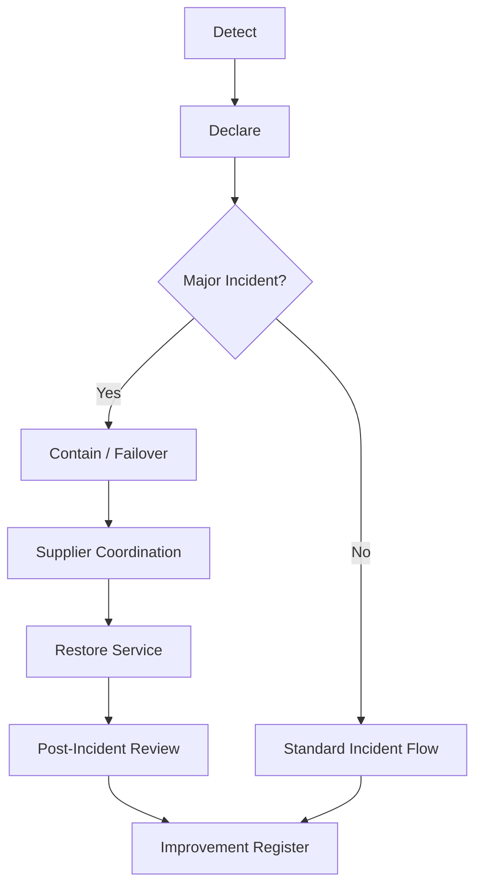

# 3. Operational Readiness

*Incident response, recovery, and learning model.*

## Major Incident Playbook

| Phase | Action | Owner |
| :--- | :--- | :--- |
| Detect | Monitoring alert or user report | IT Ops |
| Declare | Confirm impact and declare major incident | Incident Commander |
| Contain | Limit blast radius / activate failover | Technical Lead |
| Coordinate | Engage suppliers and support teams | IT PM |
| Restore | Verify stable service after fix/rollback | Technical Lead |
| Close Comms | Publish final status update | Communications Lead |

## RCA Method Selection

- **5 Whys:** for linear and bounded failures
- **Contributing Factors:** for multi-cause incidents across AI, KB, routing, people, or suppliers
- **Blameless principle:** analyze system conditions, not individuals

## Operational KPIs

- War-room activation: **<= 15 min** for severe incidents
- Incident communication cadence: **every 30 min** until stable
- PIR completion: **required for SEV1/SEV2**
- Improvement actions: **tracked in improvement register**

## Related Docs

- [1. Cover & Snapshot](./01-cover-snapshot.md)
- [2. Service Levels](./02-service-levels.md)
- [4. Change & Release](./04-change-release.md)
