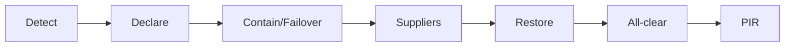

# 3. Operational Readiness

*How NordIQ runs day-to-day — and recovers when it breaks.*

## Major-Incident Playbook

| Steg | Aktivitet | Ansvarig |
| :--- | :--- | :--- |
| Identifiering | Larm från övervakning eller användare | IT Ops / Anna |
| Triage / deklaration | Bedöm påverkan och deklarera Major Incident | Incident Commander |
| Isolering / failover | Stäng AI-chatten eller aktivera Emergency Redirect | Technical Lead (Karl) |
| Leverantörskontakt | Öppna akut-tickets hos CloudFrame och Lumeon | IT-PM |
| Upplösning | Verifiera normal drift efter fix eller rollback | Technical Lead (Karl) |
| Kommunikationsstopp | Informera att faran är över | Communications Lead (Lina) |

## RCA

RCA: 5 Whys for linear failures, Contributing Factors for multi-cause incidents.

## Principer för NordIQ

- Blameless RCA — fokus på systemförhållanden
- Kopplade incidents är obligatoriska
- Workarounds har ett bäst-före-datum

## Related Docs

- [1. Cover & Snapshot](./01-cover-snapshot.md)
- [2. Service Levels](./02-service-levels.md)
- [4. Change & Release](./04-change-release.md)
