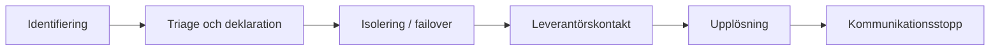

# 3. Operational Readiness

*How NordIQ runs day-to-day — and recovers when it breaks.*

## Major-Incident Playbook

Handlingsplan/krismanual för NordTechs hantering om NordIQ drabbas av ett allvarligt driftproblem efter go-live. Incidenter ska ses som en oplanerad händelse som orsakar ett avbrott.

#### Stora incidenter som kan inträffa

- NordIQ ligger nere
- Lumeon API svarar inte
- AI felklassar många ärenden
- Användare får felaktiga svar
- Eskalering till IT Ops fungerar inte

| Steg | Aktivitet | Ansvarig |
| :--- | :--- | :--- |
| Identifiering | Larm från övervakning eller att Lina (HR) ringer och säger att AI:n blivit galen. | IT Ops / Anna |
| Triage och deklaration | Bedöm: Påverkar detta alla? Ja → Deklarera Major Incident. | Incident Commander |
| Isolering / failover | Det viktigaste steget för NordIQ: Ska vi stänga av AI-chatten helt eller aktivera “Emergency Redirect” till gamla portalen? | Technical Lead (Karl) |
| Leverantörskontakt | Kontrollera status hos CloudFrame och Lumeon. Öppna akut-tickets hos dem. | IT-PM (vi) |
| Upplösning | Verifiera att tjänsten fungerar normalt igen (efter fix eller rollback). | Technical Lead (Karl) |
| Kommunikationsstopp | Informera organisationen om att faran är över. | Communications Lead (Lina) |

## Problem-Management Approach

### 5 Whys

RCA-tillvägagångssätt för återkommande fel i NordIQ. För enkla, avgränsade problem används 5 Whys — en iterativ Root Cause Analysis som tar reda på anledningen till att ett fel inträffat genom att återkommande ställa frågan “Why?” fem gånger.

### Contributing Factors

För mer komplexa incidenter används Contributing Factors, eftersom fel kan bero på en kombination av AI-agenten, Knowledge Base, routing, människor och leverantörer.

Contributing Factors är en RCA som identifierar situation, systemets status, och vilka händelser som ökar sannolikheten för att en incident inträffar — men som inte är den primära orsaken till det ursprungliga felet. Detta görs genom systematiska undersökningar snarare än individuella fall.

## Communication Plan (Internt)

Kommunikationsplanen gällande incidenter för NordIQ följer Incident Ladder: först sker en intern triage, därefter riktas meddelanden till berörda användare och endast vid bred påverkan till alla användare.

Kommunikation sker på Fast Cadence. Communications Lead ansvarar för uppdateringar så att Incident Commander kan fokusera på koordinering.

CIO Martin får 30-minutersstatus vid större incidenter. CFO Erik kopplas in när leverantörsberoende eller avtalsmässiga konsekvenser kan vara relevanta, särskilt gällande CloudFrame Nordic eller Lumeon API.

| Målgrupp | När informeras de? | Vad behöver de veta? | Kanal / cadence |
| :--- | :--- | :--- | :--- |
| Anna / Ops + Karl / Dev | Direkt efter triage | Severity, påverkan, teknisk hypotes, vem som är IC/SME | War room / Teams, löpande |
| Martin, CIO | Vid Sev 1 eller större verksamhetspåverkan | Status, risk, beslutspunkter, nästa update | Var 30:e minut tills stabilt |
| Anställda / affected users | När användare påverkas | “Använd inte NordIQ-chatten just nu. Maila supporten istället.” + nästa uppdatering | Teams/mail, vid start + all-clear |
| Alla användare | Endast vid bred påverkan | Kort störningsinfo, workaround, när nästa besked kommer | Teams broadcast / intranät |
| Erik, CFO | Om leverantör kan vara orsak eller kostnad påverkas | Om CloudFrame/Lumeon verkar orsaka avbrottet, bevisläge, potentiellt vite/kontraktsfråga | Direkt ping + incidentrapport |
| CloudFrame / Lumeon | Om deras komponent misstänks | Tekniska symptom, tidslinje, SLA/UC-fråga, begärd åtgärd | Supplier ticket + eskalering |

## Post-Incident Review (PIR)

Efter en SEV1- eller SEV2-incident genomför NordTech en Post-Incident Review för att förstå vad som hände, varför det hände och vilka förbättringar som krävs. Syftet är att förbättra NordIQ som tjänst.

- Vad hände?
- Varför hände det? (Root cause)
- Hur ser vi till att det aldrig händer igen? (Input till Problem Management.)

## Continual Improvement Register

Registret behövs för att alla förbättringsförslag inte ska gå förlorade. Det ger teamen en grund att stå på vid förbättringar, tilldelar ägandeskap och skapar struktur — lite som en backlog.

Utöver registret bör det skapas en plan för hur ofta registret ska granskas, samt en retro över resultatet och hur förbättringen ska upprätthållas.

## On-call & Escalation Map

Detta är ett schema för att tydliggöra vem som är ansvarig vid Severity 1- och 2-incidenter (då dessa är så pass allvarliga att de måste få en snabb lösning). Om ansvarig medarbetare inte kan hantera incidenten ska det finnas en tydlig escalation map över vem den kan eskalera till. Rollerna är tillfälliga och axlas enbart när en incident inträffar.

I on-call-schemat ska det anges vem som är first point of contact och vem som kontaktas om denne inte är tillgänglig. Det ska finnas ett handover-protokoll så att all information kan överföras från ett skift till ett annat. Det måste även finnas information om vilka kompetenser de ansvariga har, så att personen som tilldelas en roll vid en incident har rätt kompetens för att axla den.

Följande roller är viktiga att ha. Dessa personer ska samlas i ett så kallat “war room” inom 15 minuter där incidenten diskuteras för att nå en lösning snabbt. Rummet behöver inte vara specifikt för ändamålet utan kan variera eller vara digitalt — syftet är att kunna samlas för att hantera incidenten. När en handlingsplan tagits fram ska alla uppdatera Incident Commander var 30:e minut tills problemet är löst.

## Principer för NordIQ

- **Blameless RCA —** utredningen frågar vilka systemförhållanden som tillät felet, inte vem som begick det.
- **Kopplade incidents är obligatoriska —** ett problem-ticket utan länkade incidents saknar faktaunderlag och hanteras inte.
- **Workarounds har ett bäst-före-datum —** failover-läget (omdirigering till SharePoint + manuell ticket) är en tillfällig lösning. Om det aktiveras fler än 2 gånger på 30 dagar öppnas ett problem-ticket för permanent åtgärd.
