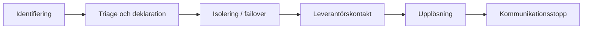

# 3. Operational Readiness

*How NordIQ runs day-to-day — and recovers when it breaks.*

## Varför

Operational readiness säkerställer att NordIQ kan hanteras stabilt i vardagen och att större incidenter hanteras snabbt, tydligt och lärande.

## Beslut / Krav

- Major incidents ska hanteras med tydlig playbook och rollfördelning.
- Problem Management ska använda både 5 Whys och Contributing Factors beroende på komplexitet.
- Kommunikation ska följa Incident Ladder med fast cadence.
- PIR ska genomföras efter SEV1/SEV2.
- On-call och eskalering ska vara tydligt dokumenterad.

## Mätetal

| Mätområde | Mål |
| :--- | :--- |
| War-room aktivering | Inom 15 minuter vid allvarlig incident |
| Statusuppdatering under incident | Var 30:e minut till stabilt läge |
| PIR-genomförande | Efter varje SEV1/SEV2 |
| Förbättringsuppföljning | Åtgärder in i Continual Improvement Register |

## Ansvarig

- **Incident Commander:** utsedd on-call roll
- **Driftansvar:** Anna (IT Ops Lead)
- **Teknisk återställning:** Karl (Dev Lead)
- **Kommunikation:** Lina (Communications Lead vid incident)

## Nästa steg

1. Fastställ faktisk on-call-rotation med backup-personer.
2. Dokumentera handover-protokoll mellan skift.
3. Schemalägg återkommande granskning av förbättringsregistret.

## Vidare läsning

- [1. Cover & Snapshot](./01-cover-snapshot.md)
- [2. Service Levels](./02-service-levels.md)
- [4. Change & Release](./04-change-release.md)
