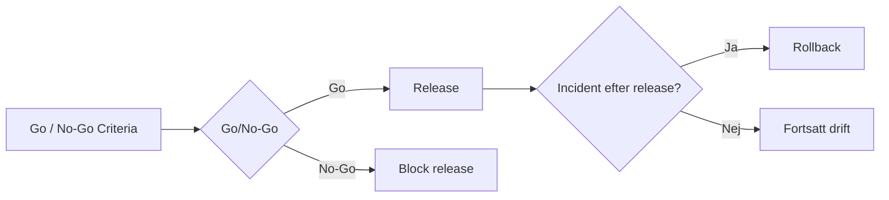

# 4. Change & Release

*The plan to take NordIQ into production — and back out.*

## CAB Design[^cab]

### Change Authority

Martin Lindqvist (CIO) — ansvarar över go-live-besluten och äger de politiska riskerna.

Martin Lindqvist är formell Change Authority för NordIQ go-live. Han äger det slutliga Go/No-Go-beslutet eftersom förändringen påverkar hela NordTechs interna supportmodell och innebär politisk risk mot ledning och verksamhet. CAB:s roll är att ge Martin ett tillräckligt komplett underlag för beslut, inte att ersätta hans ansvar.

### Change Advisory Board

**Anna Berg (IT Ops Lead)**  
Ärver NordIQ efter go-live och behöver kunna lita på att tjänsten är driftbar. Hennes fokus är incidenthantering, eskalering, second-line-belastning och om tjänsten går att underhålla i vardagen.

**Karl Eek (Internal Dev Lead)**  
Innehar förståelse för agentplattformen samt den tekniska risk som existerar bakom NordIQ. Hans roll i CAB är att förklara systemets begränsningar, AI-agentens beteende, integrationsrisker, tekniska beroenden och hur snabbt teamet kan åtgärda fel efter go-live.

**Erik Holm (CFO)**  
Äger leverantörsavtalen med CloudFrame Nordic och Lumeon API samt följer kostnadsutvecklingen. Hans perspektiv är viktigt eftersom NordIQ är beroende av externa leverantörer och eftersom LLM-användning kan skapa rörliga kostnader som behöver vara synliga och kontrollerade.

**Lina Nordin (Head of HR)**  
Är en av de tyngsta interna användarna av first-line support, särskilt vid onboarding, åtkomstfrågor och medarbetarrelaterade IT-behov. Hon representerar användarperspektivet och är troligen en av de första som märker om NordIQ ger felaktiga svar, har dålig användarupplevelse eller inte löser praktiska problem i vardagen. Linas feedback är därför viktig för UAT, adoption, continual improvement och för att bedöma om tjänsten faktiskt skapar värde för medarbetarna.

## Go / No-Go Criteria

Förbestämda tester för NordIQ måste uppnås för att tjänsten ska tillåtas rulla ut för release. Följande kriterier anses som goda för att uppnå en kvalitativ release för NordIQ. Governance-kriterier måste vara observerbara innan tjänsten får passera:

- En plan för hantering av kvarstående mindre fel. P2/P3 ska vara godkända av IT Ops.
- Mindre än fem procent av test-promptar får returnera felmeddelande.
- Gröna Health Checks genom 24 sammanhängande

[^cab]: CAB = Change Advisory Board (the body that approves go-lives)

## Related Docs

- [1. Cover & Snapshot](./01-cover-snapshot.md)
- [2. Service Levels](./02-service-levels.md)
- [3. Operational Readiness](./03-operational-readiness.md)
