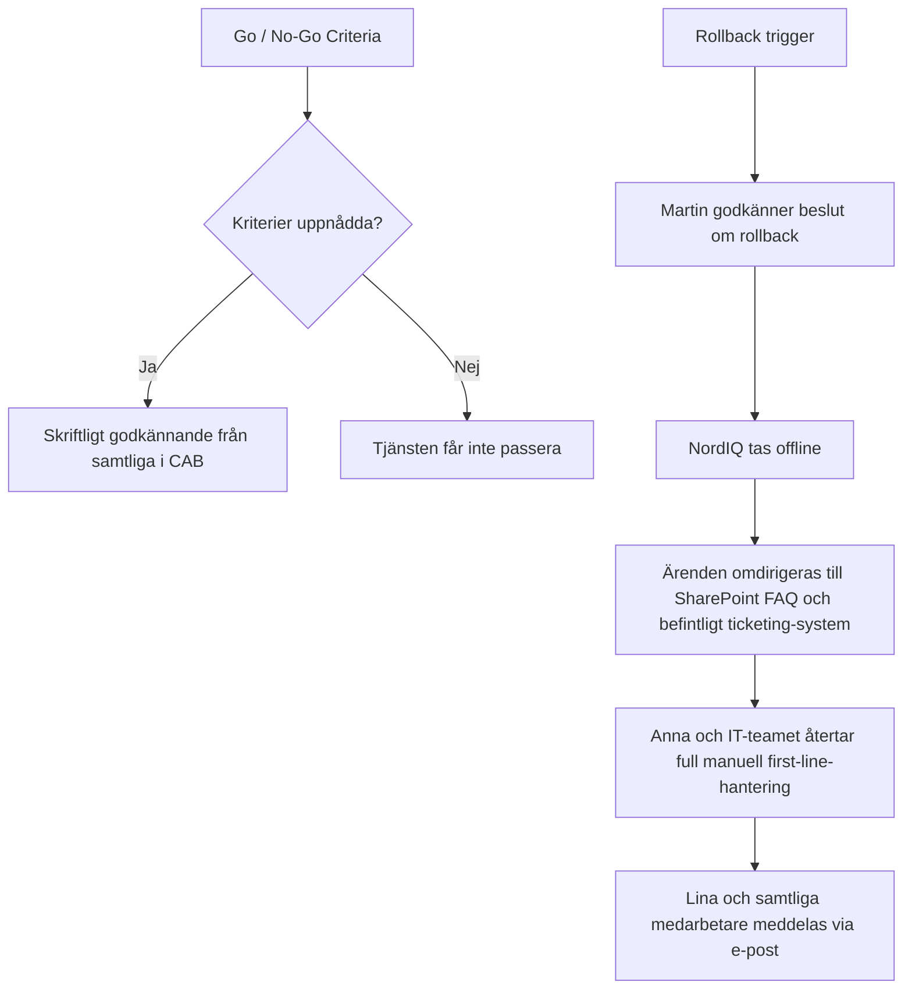

# 4. Change & Release

*The plan to take NordIQ into production — and back out.*

## Varför

Change & Release beskriver hur NordIQ går till produktion på ett kontrollerat sätt, med tydlig authority, observerbara kriterier och säker rollback.

## Beslut / Krav

- Martin (CIO) är formell Change Authority för go/no-go.
- CAB ska ge komplett beslutsunderlag från drift, teknik, kostnad och användarperspektiv.
- Go/no-go-kriterier måste vara uppfyllda innan release passerar.
- RFC ska innehålla syfte, scope, risk, tidsfönster, kommunikation, rollback och approvers.
- Rollback ska kunna aktiveras direkt vid definierade triggers.

## Mätetal

| Mätområde | Mål |
| :--- | :--- |
| Go-live readiness | Samtliga kriterier uppfyllda och godkända |
| Health checks | Gröna i 24 sammanhängande timmar |
| Testkvalitet | < 5 % felmeddelanden i test-promptar |
| Rollback-beredskap | Triggerlista och steg verifierade |

## Ansvarig

- **Change Authority:** Martin (CIO)
- **Operativ releaseberedskap:** Anna (IT Ops Lead)
- **Teknisk risk/åtgärd:** Karl (Dev Lead)
- **Leverantör/kostnadsrisk:** Erik (CFO)
- **Användarpåverkan/UAT:** Lina (HR)

## Nästa steg

1. Bekräfta att alla CAB-medlemmar godkänner kriterier och roller.
2. Kör go/no-go-gateway med dokumenterat beslutsunderlag.
3. Genomför rollback-övning innan produktionsdatum.

## Vidare läsning

- [1. Cover & Snapshot](./01-cover-snapshot.md)
- [2. Service Levels](./02-service-levels.md)
- [3. Operational Readiness](./03-operational-readiness.md)
