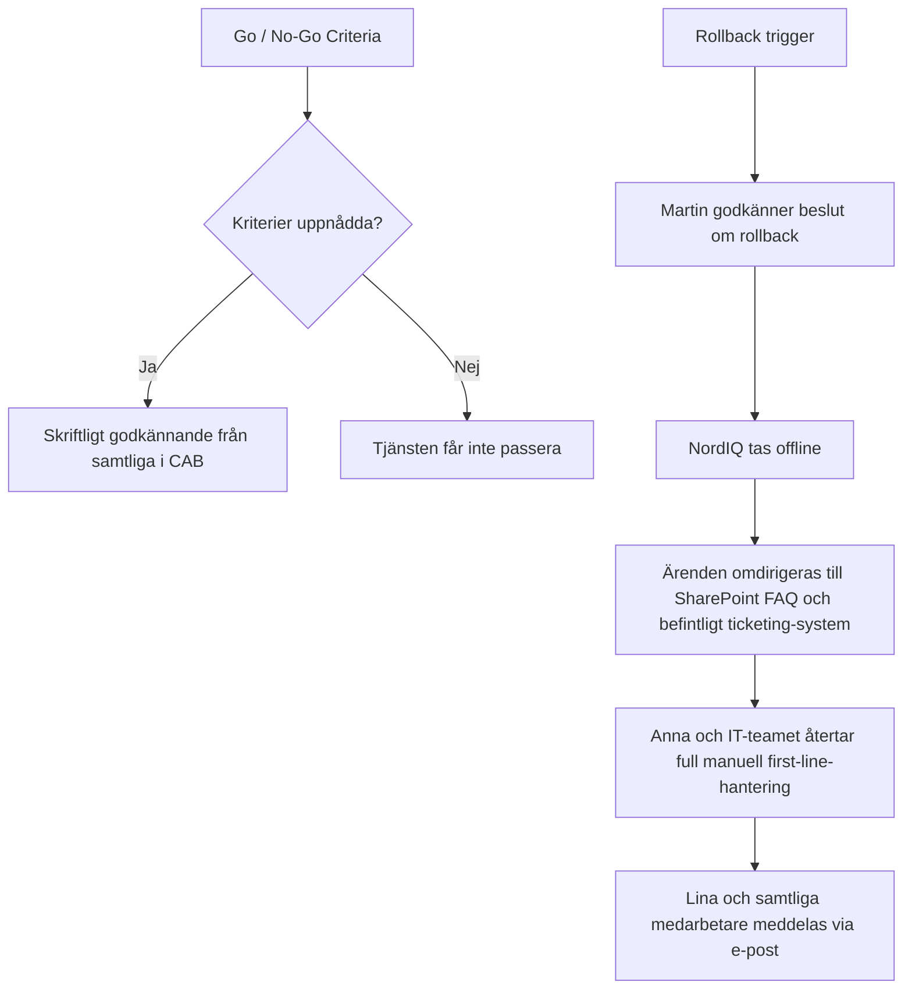

# 4. Change & Release

*The plan to take NordIQ into production — and back out.*

## CAB Design

### Change Authority

**Martin Lindqvist (CIO)** — ansvarar över go-live-besluten och äger de politiska riskerna.

Martin Lindqvist är formell Change Authority för NordIQ go-live. Han äger det slutliga go/no-go-beslutet eftersom förändringen påverkar hela NordTechs interna supportmodell och innebär politisk risk mot ledning och verksamhet. CAB:s roll är att ge Martin ett tillräckligt komplett underlag för beslut, inte att ersätta hans ansvar.

### Change Advisory Board

**Anna Berg (IT Ops Lead)**

Ärver NordIQ efter go-live och behöver kunna lita på att tjänsten är driftbar. Hennes fokus är incidenthantering, eskalering, second-line-belastning och om tjänsten går att underhålla i vardagen.

**Karl Eek (Internal Dev Lead)**

Innehar förståelse för agentplattformen samt den tekniska risk som existerar bakom NordIQ. Hans roll i CAB är att förklara systemets begränsningar, AI-agentens beteende, integrationsrisker, tekniska beroenden och hur snabbt teamet kan åtgärda fel efter go-live.

**Erik Holm (CFO)**

Äger leverantörsavtalen med CloudFrame Nordic och Lumeon API samt följer kostnadsutvecklingen. Hans perspektiv är viktigt eftersom NordIQ är beroende av externa leverantörer och eftersom LLM-användning kan skapa rörliga kostnader som behöver vara synliga och kontrollerade.

**Lina Nordin (Head of HR)**

Är en av de tyngsta interna användarna av first-line support, särskilt vid onboarding, åtkomstfrågor och medarbetarrelaterade IT-behov. Hon representerar användarperspektivet och är troligen en av de första som märker om NordIQ ger felaktiga svar, har dålig användarupplevelse eller inte löser praktiska problem i vardagen. Linas feedback är därför viktig för UAT, adoption, continual improvement och för att bedöma om tjänsten faktiskt skapar värde för medarbetarna.

## Go / No-Go Criteria

Förbestämda tester för NordIQ måste uppnås för att tjänsten ska tillåtas rulla ut för release. Följande kriterier anses som goda för att uppnå en kvalitativ release för NordIQ. Governance-kriterier måste vara observerbara innan tjänsten får passera:

- En plan för hantering av kvarstående mindre fel. P2/P3 ska vara godkända av IT Ops.
- Mindre än fem procent av test-promptar får returnera felmeddelande.
- Gröna Health Checks genom 24 sammanhängande timmar.
- Skriftligt godkännande ska finnas underskrivet av samtliga i CAB.
- Samtliga acceptanskriterier är uppnådda och tester för normalflöden är godkända i kvalitetssäkrad miljö.

## Request for Change (RFC)

### 1. Purpose

Syftet med RFC:n är att få ett formellt godkännande för att lansera NordIQ som AI-stödd first-line support. Förändringen ska minska väntetider, avlasta manuell support och ge medarbetare snabbare hjälp med vanliga IT-ärenden.

### 2. Scope

RFC:n omfattar lansering av NordIQ för interna medarbetare på NordTech. Den inkluderar AI-agenten, Knowledge Base, klassificering av ärenden, escalation flow, fallback-lösning och koppling till befintligt ärendehanteringssystem.

### 3. Technical Change Description

NordIQ införs som en AI-baserad supportkanal som kan ta emot, klassificera och besvara vanliga IT-supportfrågor. Tjänsten använder Lumeon API för AI-svar, CloudFrame Nordic för drift/hosting och befintliga system för eskalering och ticketing.

### 4. Risk Assessment

De största riskerna är felaktiga AI-svar, felklassificering av ärenden, avbrott hos Lumeon API eller CloudFrame, föråldrad Knowledge Base och att eskalering till IT Ops inte fungerar. Riskerna hanteras genom SLO/SLI, monitoring, fallback, incident playbook och rollback-plan.

### 5. Rollback Plan

Om NordIQ inte fungerar efter go-live kan tjänsten pausas och supportflödet återgå till tidigare arbetssätt. Användare kan då hänvisas till SharePoint FAQ och befintligt ticketing-system, medan manuell first-line support aktiveras vid behov.

### 6. Timeline and Window

Go-live bör ske under en kontrollerad tidsperiod med låg belastning, exempelvis under arbetstid när IT Ops, Karl och leverantörer är tillgängliga. Efter lansering följs tjänsten extra noga under en hypercare-period.

### 7. Communication Plan

Berörda medarbetare informeras innan go-live om vad NordIQ är, hur tjänsten används och hur ärenden eskaleras. Vid problem kommunicerar IT Ops status enligt incidentplanen, med uppdateringar till användare och relevanta stakeholders.

### 8. Approver List

Go-live bör godkännas av Martin Lindqvist som CIO och beslutsägare, med input från Anna Berg för drift, Karl Eek för teknik, Erik Holm för leverantörs- och kostnadsrisker samt Lina Nordin för användarperspektivet.

## Change Enablement — Rollback Plan

### Trigger

- NordIQ ger ingen respons på mer än 10 % av inkommande requests.
- Lumeon API är otillgänglig i mer än 30 minuter.
- AI:ns felklassificeringsgrad överstiger accepterad nivå.
- Eskalering till IT Ops slutar fungera.

### Rollback Steps

1. Martin (Change Authority) godkänner beslut om rollback.
2. NordIQ tas offline.
3. Inkommande ärenden omdirigeras automatiskt till FAQ-sidor i SharePoint och tickets skapas i det befintliga ärendehanteringssystemet utan AI-hantering.
4. Anna och IT-teamet återtar full manuell first-line-hantering.
5. Lina (HR) och samtliga medarbetare meddelas via e-post.

### What Stays, What Restores

- AI-agentplattformen förblir driftsatt men inaktiv.
- Ingen data går förlorad — all ärendehistorik bevaras.
- Avtal med CloudFrame och Lumeon kvarstår.
