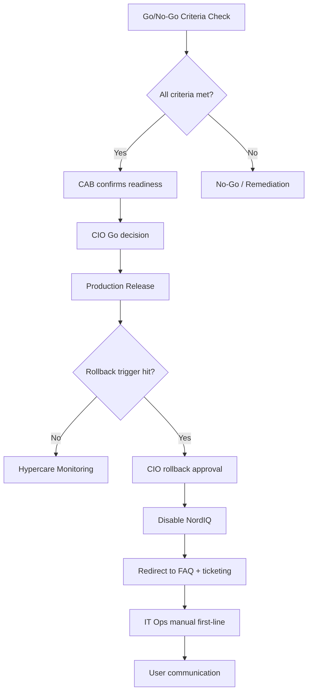

# 4. Change & Release

*Go/No-Go governance and controlled rollback.*

## Governance Model

- **Change Authority:** CIO owns final Go/No-Go decision
- **CAB input:** IT Ops, Dev, CFO, and HR provide operational, technical, cost, and user readiness signals
- **Release principle:** No release without observable criteria and rollback readiness

## Go/No-Go Criteria

- Approved plan for residual P2/P3 defects
- < 5% failed responses in test prompts
- Green health checks for 24 continuous hours
- Written CAB approvals completed
- Acceptance criteria passed in quality-assured environment

## RFC Minimum Template

1. Purpose
2. Scope
3. Technical Change Description
4. Risk Assessment
5. Rollback Plan
6. Timeline and Window
7. Communication Plan
8. Approver List

## Decision & Rollback Flow

## Release KPIs

- Criteria completion: **100% before release**
- Health check stability: **24h green window**
- Rollback drill readiness: **verified before go-live**

## Related Docs

- [1. Cover & Snapshot](./01-cover-snapshot.md)
- [2. Service Levels](./02-service-levels.md)
- [3. Operational Readiness](./03-operational-readiness.md)
