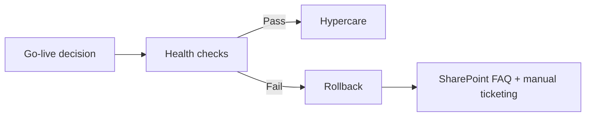

# 4. Change & Release

*The plan to take NordIQ into production — and back out.*

## CAB Design[^cab]

### Change Authority

Martin Lindqvist (CIO) — owns Go/No-Go decision.

### Change Advisory Board

- Anna Berg (IT Ops Lead) — driftbarhet, incidenthantering
- Karl Eek (Dev Lead) — teknisk risk, AI-agentens beteende
- Erik Holm (CFO) — leverantörsavtal, kostnadsrisk
- Lina Nordin (Head of HR) — användarperspektiv, UAT

## Go / No-Go Criteria

- P2/P3-plan godkänd av IT Ops
- Mindre än fem procent av test-promptar får fel
- Gröna Health Checks i 24 timmar

[^cab]: CAB = Change Advisory Board (the body that approves go-lives)

## Related Docs

- [1. Cover & Snapshot](./01-cover-snapshot.md)
- [2. Service Levels](./02-service-levels.md)
- [3. Operational Readiness](./03-operational-readiness.md)
